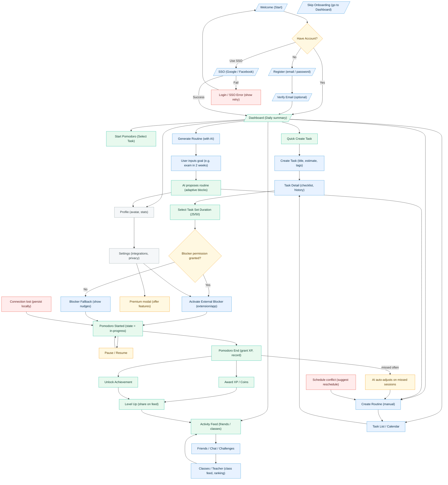

```mermaid
flowchart TD
  %% --- Onboarding & Auth ---

    WELCOME[/"Welcome (Start)"/]:::blue
    CHOICE{Have Account?}:::yellow
    REGISTER[/"Register (email / password)"/]:::blue
    SSO[/"SSO (Google / Facebook)"/]:::blue
    VERIFY[/"Verify Email (optional)"/]:::yellow
    SKIP_ONB[/"Skip Onboarding (go to Dashboard)"/]:::gray


  %% --- Dashboard ---
    DASHBOARD[/"Dashboard (Daily summary)"/]:::green
    START_POMO["Start Pomodoro (Select Task)"]:::green
    QUICK_CREATE["Quick Create Task"]:::green
    FEED["Activity Feed (friends / classes)"]:::green

  %% --- Tasks & Routines ---
    TASK_LIST["Task List / Calendar"]:::blue
    CREATE_TASK["Create Task (title, estimate, tags)"]:::blue
    TASK_DETAIL["Task Detail (checklist, history)"]:::blue
    CREATE_ROUTINE["Create Routine (manual)"]:::blue
    IA_GENERATE["Generate Routine (with AI)"]:::blue

  %% --- Pomodoro & Blocker ---
    P_SELECT["Select Task Set Duration (25/50)"]:::green
    P_START["Pomodoro Started (state = in-progress)"]:::green
    P_PAUSE["Pause / Resume"]:::yellow
    P_END["Pomodoro End (grant XP, record)"]:::green
    BLOCKER_REQ{"Blocker permission granted?"}:::yellow
    BLOCKER_ACTIVATE["Activate External Blocker (extension/app)"]:::blue
    BLOCKER_FAIL["Blocker Fallback (show nudges)"]:::red

  %% --- Gamification & Social ---
    XP["Award XP / Coins"]:::green
    ACHIEVEMENT["Unlock Achievement"]:::green
    LEVEL_UP["Level Up (share on feed)"]:::green
    FRIENDS["Friends / Chat / Challenges"]:::blue
    CLASS["Classes / Teacher (class feed, ranking)"]:::blue

  %% --- AI ---
    AI_REQ["User inputs goal (e.g. exam in 2 weeks)"]:::blue
    AI_RESP["AI proposes routine (adaptive blocks)"]:::green
    AI_ADJUST["AI auto-adjusts on missed sessions"]:::yellow

  %% --- Profile & Settings ---
    PROFILE_VIEW["Profile (avatar, stats)"]:::gray
    SETTINGS["Settings (integrations, privacy)"]:::gray
    PREMIUM["Premium modal (offer features)"]:::yellow

  %% --- Errors & Exceptions ---
    ERR_LOGIN["Login / SSO Error (show retry)"]:::red
    ERR_SYNC["Connection lost (persist locally)"]:::red
    ERR_CONFLICT["Schedule conflict (suggest reschedule)"]:::red

  %% --- Links between sections ---
  %% Onboarding flow
  WELCOME --> CHOICE
  CHOICE -- Yes --> DASHBOARD
  CHOICE -- No --> REGISTER
  REGISTER --> VERIFY
  VERIFY --> DASHBOARD
  CHOICE -- Use SSO --> SSO
  SSO -->|Success| DASHBOARD
  SSO -->|Fail| ERR_LOGIN

  %% Dashboard entrypoints
  DASHBOARD --> START_POMO
  DASHBOARD --> QUICK_CREATE
  DASHBOARD --> FEED
  DASHBOARD --> TASK_LIST
  DASHBOARD --> PROFILE_VIEW

  %% Tasks -> Pomodoro
  QUICK_CREATE --> CREATE_TASK
  CREATE_TASK --> TASK_DETAIL
  TASK_LIST --> TASK_DETAIL
  TASK_DETAIL --> P_SELECT

  %% Routines (manual + AI)
  DASHBOARD --> CREATE_ROUTINE
  CREATE_ROUTINE --> TASK_LIST
  DASHBOARD --> IA_GENERATE
  IA_GENERATE --> AI_REQ
  AI_REQ --> AI_RESP
  AI_RESP --> CREATE_ROUTINE
  AI_RESP --> PROFILE_VIEW

  %% Pomodoro lifecycle
  P_SELECT --> BLOCKER_REQ
  BLOCKER_REQ -- Yes --> BLOCKER_ACTIVATE
  BLOCKER_REQ -- No --> BLOCKER_FAIL
  BLOCKER_ACTIVATE --> P_START
  BLOCKER_FAIL --> P_START
  P_START --> P_PAUSE
  P_PAUSE --> P_START
  P_START --> P_END
  P_END --> XP
  P_END --> ACHIEVEMENT

  %% Gamification interactions
  XP --> LEVEL_UP
  ACHIEVEMENT --> LEVEL_UP
  LEVEL_UP --> FEED
  FEED --> FRIENDS
  FRIENDS --> CLASS
  CLASS --> FEED

  %% AI adjustments
  AI_ADJUST --> CREATE_ROUTINE
  P_END -- missed often --> AI_ADJUST

  %% Profile & settings interactions
  PROFILE_VIEW --> SETTINGS
  SETTINGS --> BLOCKER_ACTIVATE
  SETTINGS --> PREMIUM

  %% Errors
  ERR_LOGIN --> WELCOME
  ERR_SYNC --> P_START
  ERR_CONFLICT --> CREATE_ROUTINE

  %% Class styles (cores)
  classDef green fill:#e8f9ee,stroke:#1abc9c,stroke-width:1px,color:#0b3b2e;
  classDef blue  fill:#e8f2ff,stroke:#3498db,stroke-width:1px,color:#052a44;
  classDef yellow fill:#fff8e1,stroke:#f39c12,stroke-width:1px,color:#5a3b00;
  classDef red   fill:#ffecec,stroke:#e74c3c,stroke-width:1px,color:#581617;
  classDef gray  fill:#f5f7f9,stroke:#95a5a6,stroke-width:1px,color:#2d3b3c;

  %% Agrupar classes em nós (caso necessário para editores que não aplicam classDefs automaticamente)
  class WELCOME,REGISTER,SSO,VERIFY,SKIP_ONB blue;
  class DASHBOARD,START_POMO,QUICK_CREATE,FEED green;
  class TASK_LIST,CREATE_TASK,TASK_DETAIL,CREATE_ROUTINE,IA_GENERATE blue;
  class P_SELECT,P_START,P_END,XP,ACHIEVEMENT,LEVEL_UP green;
  class P_PAUSE,BLOCKER_REQ,AI_ADJUST,PREMIUM yellow;
  class BLOCKER_ACTIVATE,BLOCKER_FAIL,FRIENDS,CLASS blue;
  class PROFILE_VIEW,SETTINGS gray;
  class ERR_LOGIN,ERR_SYNC,ERR_CONFLICT red;

```